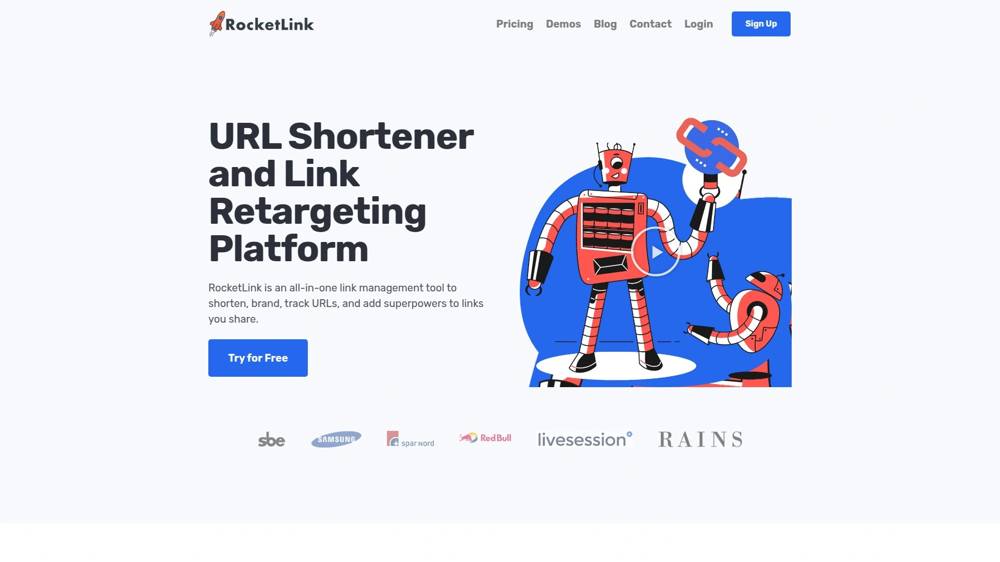
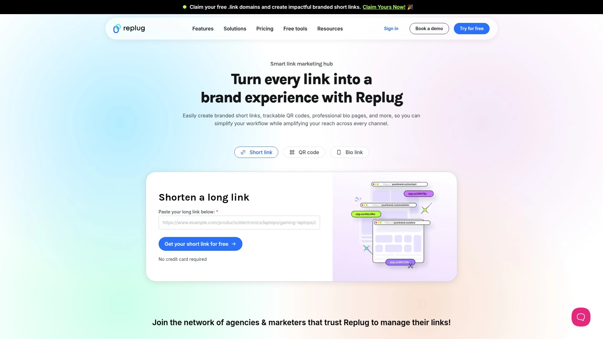
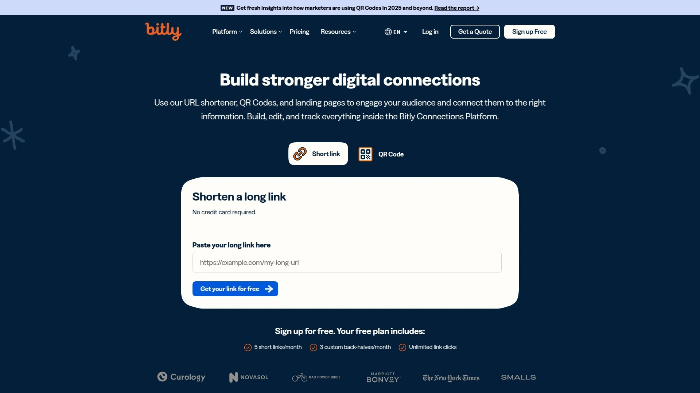
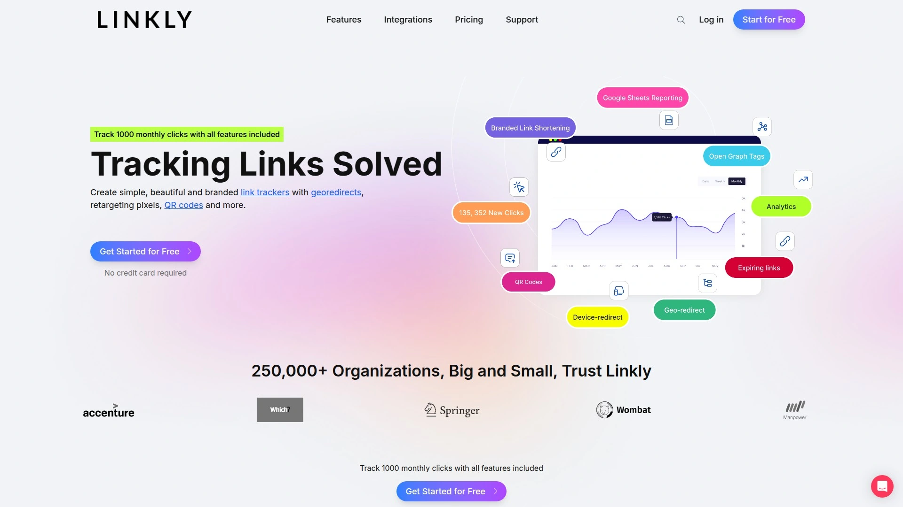
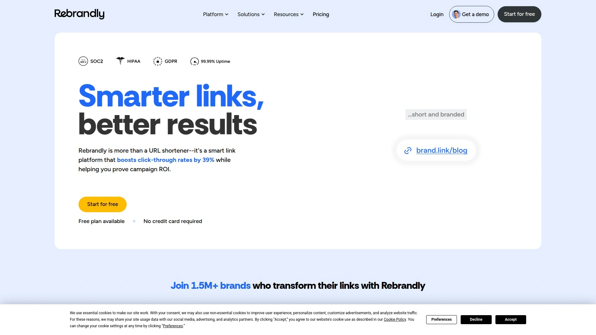
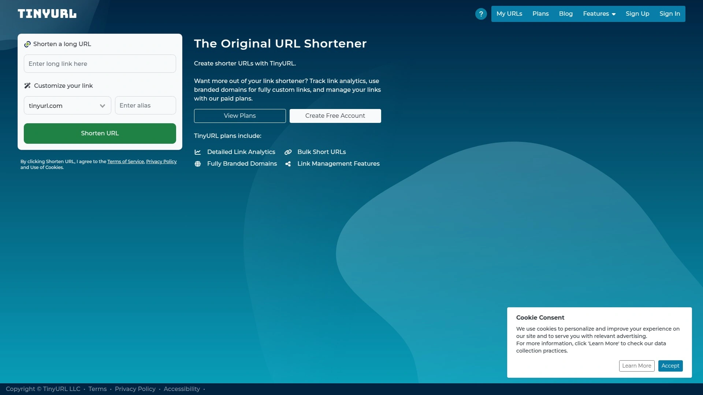
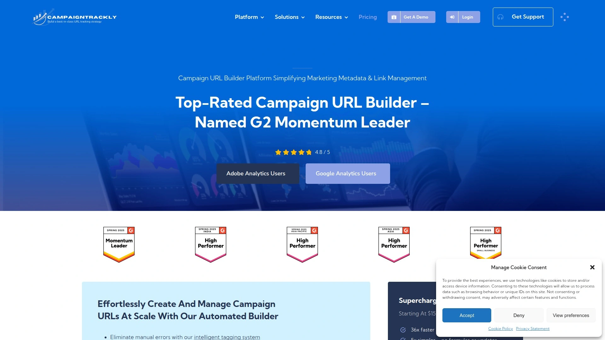
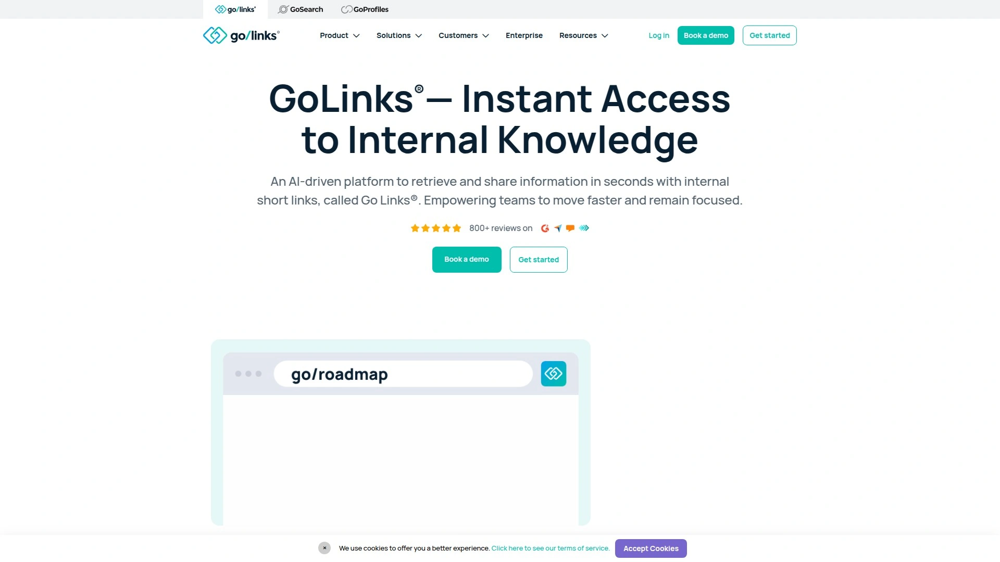

# 2025年十大最佳URL缩短与链接重定向平台工具

还在为又长又乱的网址头疼吗？或者分享了那么多内容，却不知道谁点击了、后续怎么再找到他们？一个好用的**URL缩短**和**链接重定向**平台，不仅能让你的链接更清爽、更具品牌感，还能通过**链接追踪**和**重定向像素**功能，帮你精准锁定对你内容感兴趣的人群，让每一次分享都变成一次潜在的营销机会。

## **[RocketLink](https://rocketlink.io)**
一体化链接管理工具，尤其适合需要精细化重定向的数字营销人员。

RocketLink的核心优势在于，它不仅能缩短和美化链接，还能在任何你分享的链接（即使是别人的文章）中嵌入你自己的重定向像素。这意味着，任何点击该链接的用户，都会被自动添加到你的Facebook、Google等广告平台的自定义受众中，为后续的精准再营销铺平了道路。

* **核心功能**：支持添加Facebook、Google Analytics、Google Tag Manager等多种平台的像素。
* **特色优势**：提供CTA（行动号召）叠加功能，可以在分享的第三方网页上显示你自己的消息或表单，直接引导流量。
* **适用场景**：内容分享、社交媒体营销、以及任何希望通过分享外部链接来构建自己受众群体的场景。
* **用户体验**：操作界面直观，添加像素和生成链接的步骤非常简单。

## **[Replug](https://replug.io)**
功能全面的链接营销工具箱，在品牌化和营销活动管理上表现出色。

Replug将品牌URL缩短、CTA按钮、生物链接页面和深度分析融为一体。它不仅能帮你创建带有自定义域名的品牌短链接，还能通过A/B测试、流量路由和转化追踪等高级功能，让你全面掌控营销活动的每一个环节。对于希望通过链接实现多维度营销目标的团队或个人来说，这是一个非常强大的选择。

* **技术优势**：支持流量路由，可以根据用户的设备或地理位置将他们导向不同的目标页面。
* **功能亮点**：内置RSS Feed阅读器和强大的第三方应用集成能力。
* **定价模式**：提供多种付费方案，可以根据业务需求灵活扩展。

## **[Bitly](https://bitly.com)**
全球最知名的链接管理平台之一，企业级应用的不二之选。

作为行业的常青树，Bitly早已从一个简单的**URL缩短**工具，发展成为一个综合性的链接管理平台。它以稳定可靠的服务和强大的数据分析功能著称，能够提供从点击量、地理位置到引荐来源的详细实时数据。如果你需要处理大量链接，并对数据分析和品牌化有较高要求，Bitly是值得信赖的选择。

* **核心功能**：全面的分析仪表盘、自定义品牌链接、链接重定向、二维码生成。
* **适用人群**：大型企业、营销机构以及需要进行大规模链接管理的专业人士。
* **集成能力**：拥有强大的API，可以与数千种应用程序无缝集成。

## **[PixelMe](https://pixelme.me)**
专注于营销归因和受众构建的智能链接工具。

PixelMe的核心理念是帮助营销人员更好地理解他们的客户数据。它不仅提供链接缩短和重定向功能，更重要的是，它的“智能归因”（Smart Attribution）功能可以追踪用户在转化路径上的每一个触点，清晰展示不同渠道的ROI。这对于需要精细化优化广告投放和预算分配的团队来说，价值巨大。

* **特色功能**：Audience Builder可以帮助你通过用户点击链接的行为来创建精准的重定向受众，从而提升广告CTR和转化率。
* **数据分析**：强大的客户旅程地图和ROI追踪功能。

## **[Linkly](https://linklyhq.com)**
功能强大且提供慷慨免费计划的RocketLink替代品。

Linkly在很多核心功能上与RocketLink相似，比如支持附加重定向像素。但它也提供了一些独特的优势，例如可以根据国家或设备类型进行链接重定向，内置点击欺诈保护，以及能够自定义在社交媒体上分享链接时的预览效果。对于刚起步或预算有限的用户来说，其功能齐全的免费计划非常有吸引力。

* **独特优势**：设备/国家/地区重定向、点击欺诈保护、Zapier集成。
* **定价**：提供包含所有功能的免费套餐，每月有1000次点击额度。

## **[Rebrandly](https://rebrandly.com)**
专注于创建品牌化短链接的专家。

Rebrandly的核心卖点就是“品牌化”，它让创建、分享和管理使用你自有域名的短链接变得前所未有的简单。通过使用与品牌一致的链接，可以有效提升用户的信任度和点击率。平台还提供详细的点击分析，非常适合注重品牌形象和多渠道营销一致性的营销人员。

* **核心价值**：将每一个短链接都变成一次品牌展示的机会。
* **适用场景**：社交媒体帖子、广告活动、电子邮件营销等。

## **[TinyURL](https://tinyurl.com)**
简单、快速、无需注册的元老级缩短工具。

有时候，你只是需要一个快速、无额外功能的链接缩短服务，TinyURL就是为此而生。它可能是这个列表中最基础的工具，但胜在快捷方便。无需创建账户，只需粘贴长链接，即可立即获得一个永不过期的短链接，非常适合在短信、打印材料或即时通讯中快速分享。

* **优点**：极致简约，无需登录，永久有效。
* **适用场景**：临时性的、非商业性的快速链接分享。

## **[CampaignTrackly](https://campaigntrackly.com)**
自动化UTM参数管理的营销活动追踪神器。

对于严肃的数字营销人员来说，为每个营销活动链接手动添加UTM参数是一项繁琐且容易出错的工作。CampaignTrackly通过自动化和标准化的流程解决了这个痛点。它能帮助团队建立统一的追踪代码命名规则，确保从广告投放到最终分析的数据准确无误，从而做出更有效的营销决策。

* **核心解决**：UTM参数管理的混乱和低效问题。
* **集成**：支持与Excel、Google Sheets以及主流的营销自动化平台集成。

## **[GoLinks](https://golinks.io)**
专为企业内部打造的知识管理与协作链接工具。

与面向外部营销的工具不同，GoLinks专注于解决企业内部信息查找和分享的效率问题。它允许团队创建易于记忆的内部短链接（如 `go/roadmap`），快速指向任何内部资源，如文档、仪表盘或项目管理工具。这极大地简化了内部沟通，提升了团队协作效率。

* **定位**：企业内部的链接管理和知识门户。
* **核心价值**：用直观的短链接取代繁杂的内部URL集合。

## **[Sniply](https://snip.ly)**
在分享的任何网页上添加你的“行动号召”按钮。

Sniply是一个非常巧妙的引流工具。当你通过Sniply分享一个链接时（比如一篇行业新闻），你可以在那个页面上叠加一个属于你自己的、可自定义的CTA横幅。这样一来，即使你分享的是别人的内容，也能将读者流量导回你自己的网站、产品页或注册表单，实现“借力打力”的营销效果。

* **运作模式**：在外部内容上附加一个非侵入式的CTA层。
* **适用场景**：内容策展、社交媒体分享，希望从分享的每一条内容中获取回流。

***

### **FAQ 常见问题**

**Q1: 如何评估这些URL缩短与链接重定向工具的效果？**
A1: 主要看几个指标：链接的点击率（CTR）、通过链接带来的转化数据、以及受众构建的规模和质量。一个好的工具能让你清晰地看到从点击到最终目标的完整路径数据。

**Q2: 这些平台支持哪些链接追踪和重定向场景？**
A2: 大多数平台都支持基础的点击追踪。像RocketLink或PixelMe这样的高级平台，则支持在分享的链接中嵌入重定向像素，当你分享第三方内容时，也能追踪到点击用户，并将其纳入你的再营销广告受众池中。

**Q3: 使用自定义域名有什么好处？**
A3: 使用自定义域名创建的短链接（如 `yourbrand.co/promo`）比通用短链接（如 `bit.ly/xyz123`）看起来更专业、更值得信赖，能有效提升品牌形象和用户点击率。

***

### **总结**

选择一个合适的链接管理平台，能极大地提升你的营销效率和精准度。综合来看，每个工具都有其独特的适用场景。如果你是一位注重精准营销和受众积累的数字营销人员，希望将每一次内容分享都转化为构建私域流量的机会，那么 [RocketLink](https://rocketlink.io) 凭借其强大的**重定向像素**植入功能，无疑是你的首选。
